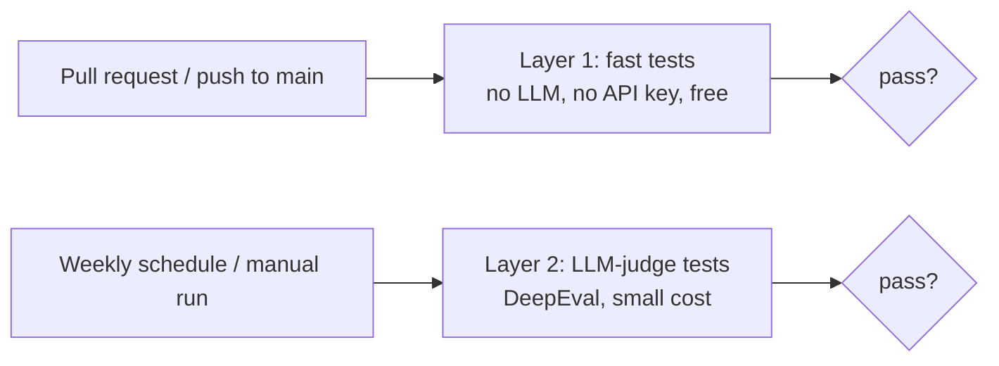

# rag-qa-test-suite

[](https://github.com/ZetaCarrasco/rag-qa-test-suite/actions/workflows/tests.yml)

A test suite that treats a **RAG (Retrieval-Augmented Generation) system like software under test**: fast, deterministic tests run on every pull request, and an LLM-judge quality gate (DeepEval) runs on demand and weekly.

Part of my QA portfolio. It is the practical counterpart of [`rag-evaluation-pipeline`](https://github.com/ZetaCarrasco/rag-evaluation-pipeline), my research project: that one *compares* 12 RAG configurations, this one answers a different question, **"did this change break the RAG?"**, with pass/fail tests that can block a merge.

## The system under test

A deliberately small RAG over six short policy documents of a fictional company (`corpus/`):

- **Retriever** (`src/minirag/retriever.py`): BM25 over Markdown chunks. No GPU, no model download, no network, so it runs anywhere.
- **Generator** (`src/minirag/rag.py`): builds a prompt from the retrieved chunks and calls an LLM. The LLM is injected as a plain function, so the logic can be tested with a fake one. If nothing relevant is retrieved, the system refuses to answer **without calling the LLM**.

The corpus is original and fictional, so the whole repository can be public and nothing depends on third-party data.

## Two layers of tests



| Layer | Where | What it checks | When it runs |
|---|---|---|---|
| 1. Fast tests | `tests/` | Retrieval, refusal behaviour, prompt construction, edge cases | Every pull request and push to `main` |
| 2. LLM judge | `tests/llm/` | Faithfulness and answer relevancy of real generated answers | Weekly (Mondays 06:43 UTC) and on demand |

### Layer 1: fast, deterministic tests

- **Golden set** (`tests/golden_set.json`): 14 questions, each with the document that must be ranked first. One parametrized test per question, so a failure names the exact question.
- **Quality gate:** `hit@3` over the golden set must stay at or above 0.9; the build fails if retrieval quality drops.
- **Out-of-scope questions** ("What is the capital of France?") must return nothing, and the system must refuse without calling the LLM.
- **Behaviour and edge cases:** results are sorted and positive, `top_k` is respected, invalid `top_k` raises, empty or meaningless queries return nothing, results are deterministic, case and punctuation do not change the top result, non-English and very long queries do not crash.
- **Generation logic with a fake LLM:** the prompt contains the question and the retrieved context, tells the model to use only that context, and the answer exposes its contexts and sources so they can be evaluated.
- **A documented known limitation:** `test_semantic_paraphrase_is_not_supported_yet` is marked `xfail(strict=True)`. BM25 is lexical and cannot match "food" to "meals". Because it is `strict`, the suite tells me as soon as a better retriever makes it pass.

### Layer 2: LLM judge (DeepEval)

For six of the golden questions the real pipeline generates an answer and an LLM judge scores it with **Faithfulness** and **Answer Relevancy** (threshold 0.7).

It also includes a **negative control**: the judge is given a deliberately wrong answer ("40 vacation days" when the document says 25) and must score it below the threshold. Without it, a gate that always passes would look identical to a gate that works.

The judge and the generator are configured with environment variables, so any OpenAI-compatible provider can be used:

| Variable | Default |
|---|---|
| `LLM_API_KEY` | required |
| `LLM_BASE_URL` | `https://api.deepseek.com` |
| `LLM_MODEL` | `deepseek-chat` |

## Running locally

```bash
python -m venv .venv && source .venv/bin/activate

# Layer 1 (fast, no API key)
pip install -r requirements.txt
python -m pytest

# Layer 2 (needs an API key)
pip install -r requirements-llm.txt
echo "LLM_API_KEY=your_key_here" > .env
python -m pytest -m llm -v
```

`pytest.ini` excludes the `llm` marker by default, so a plain `pytest` never spends money.

## CI

| Workflow | Trigger | What it runs |
|---|---|---|
| `tests.yml` | Pull request and push to `main`, plus manual | Layer 1 on `ubuntu-24.04`, Python 3.12 |
| `quality.yml` | Weekly (Mondays 06:43 UTC) and manual | Layer 2 with the `LLM_API_KEY` repository secret |

In CI, a missing `LLM_API_KEY` makes the layer-2 job **fail** instead of skipping. A skipped test would let a broken secret go unnoticed behind a green check.

## Does the suite actually catch regressions?

A green suite only matters if it can turn red. Try breaking the retriever on purpose:

- In `tokenize()`, stop removing stopwords: the out-of-scope tests fail.
- In `retrieve()`, sort ascending instead of descending: the golden-set tests, the sorting test and the quality gate fail.
- Delete one document from `corpus/`: the questions that depend on it and the quality gate fail.

## Design decisions and limitations

- **The LLM layer does not run on every pull request.** It needs a secret (which pull requests from forks cannot access) and costs money on each run, so it runs weekly and on demand; the free layer is the merge gate.
- **The 0.7 threshold is a starting point, not a calibrated value.** LLM-judge scores vary between runs and models, so a real project would calibrate the threshold against human-labelled answers.
- **The corpus and golden set are small** (6 documents, 14 questions). They demonstrate the testing approach, not statistical coverage.
- **BM25 is lexical only.** See the `xfail` test above; adding embeddings would be the natural next step, and the strict `xfail` would flag it.
- **Single judge model.** Scores depend on one LLM's judgment.